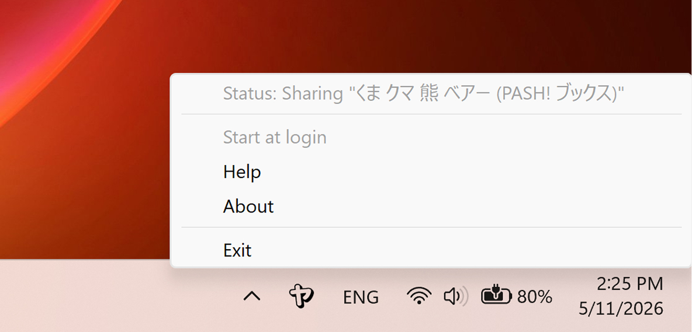
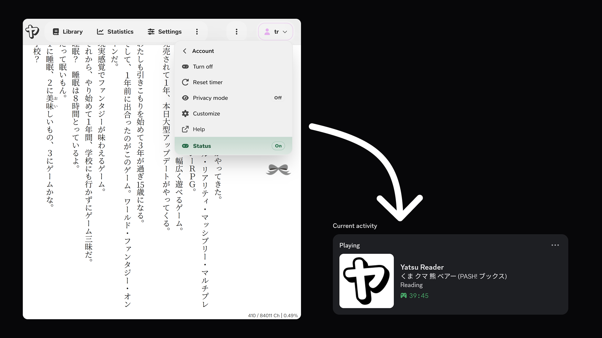

# Discord Rich Presence

Yatsu can share your current reading activity with Discord Desktop through Yatsu Companion for Windows.

Discord Rich Presence is controlled from the account menu in the top-right of Yatsu. Open **Discord Rich Presence** to turn it on or off, reset the elapsed timer, toggle privacy mode, customize its display, open help, or check the current companion status.

## Install the Companion

Yatsu Companion is available from the Microsoft Store for Windows. Install and open it on the same Windows device where you use Discord Desktop and Yatsu.

[Download Yatsu Companion for Windows](ms-windows-store://pdp/?productid=9NGNSPQ7Q84C){ .md-button .md-button--primary }

This button opens the Microsoft Store app directly on Windows. If it does not open, use the [Microsoft Store web listing](https://apps.microsoft.com/detail/9NGNSPQ7Q84C) as a fallback. On other platforms, install the companion from a Windows device instead.

After installation, Yatsu Companion lives in the Windows system tray. Its tray menu shows whether it is sharing the current book and lets you open Help, view About, toggle Start at login, or exit.

{ .yatsu-doc-screenshot }

## Requirements

- You must be signed in to Yatsu.
- Discord Desktop must be running on the same Windows device.
- Yatsu Companion must be installed and running.
- The browser must allow Yatsu to contact the local companion on `127.0.0.1`.

The companion only listens on the local device. It receives the current activity from Yatsu over loopback and publishes it to Discord Desktop.

## Status

The status row in the Discord Rich Presence menu shows whether Yatsu can reach the companion and Discord:

- **On** means the companion is detected and ready.
- **Checking**, **Install**, or **Closed** means Yatsu is waiting for the companion or Discord Desktop.
- **Blocked** or **Error** means the local request or Discord update failed.
- **Off** means Yatsu is not sharing activity.

When everything is connected, Discord shows Yatsu Reader under your current activity.

{ .yatsu-doc-screenshot .yatsu-doc-screenshot--wide }

## Supporter Customization

Yatsu Supporters can open **Customize** from the Discord Rich Presence menu.

The customization dialog lets Supporters change:

- the Discord detail line
- the reading line
- the paused line
- whether the paused state is shown
- whether the elapsed timer is shown
- whether the current chapter or section is automatically appended to the status line, when Yatsu can determine it

Use placeholders in text fields:

- `{title}` for the current book title
- `{status}` for the resolved reading or paused line
- `{percent}` for the current completion percentage
- `{chapter}` for the current chapter or section, when available

The dialog includes a small preview for reading and paused states. Chapter and section data depends on the book format and might not always be available.

The `{chapter}` placeholder can be used in text fields even when automatic chapter or section display is off.

For non-Supporters, the Customize item opens the same dialog in a locked preview state, but the default Rich Presence format is used.

## Privacy

When Discord Rich Presence is on, Yatsu sends the companion enough local activity data to update Discord, such as the displayed book title, reading or paused state, timer setting, current completion percentage or chapter if configured, and the generated browser session ID.

Privacy mode is available directly from the Discord Rich Presence menu. When privacy mode is on, Yatsu keeps Rich Presence active but sends generic Yatsu activity instead of the current book title, progress, or chapter.

Yatsu does not send book files, book content, bookmarks, highlights, storage credentials, or your Yatsu account identifiers to the companion for Rich Presence.

Supporter customization is stored in this browser for the signed-in Yatsu account. It does not upload books or reading data.
