Setting up Drive is usually the hardest part of using ttsu (the reader Yatsu comes from) and/or Yatsu.

Yatsu Accounts can now sync some app settings when you turn on Settings Sync, but book data sync with Google Drive is still separate. For now, you'll have to set up Drive manually by following the steps in this page. Sorry about that.

## Prerequisites
A Google account.

## Steps
Go to [this page](https://console.cloud.google.com/projectselector2/home/dashboard) and click on "Create Project".

In the "Project name" field, give it any name you want, then click on Create. You don't need to pick an organization in the "Parent resource" field.

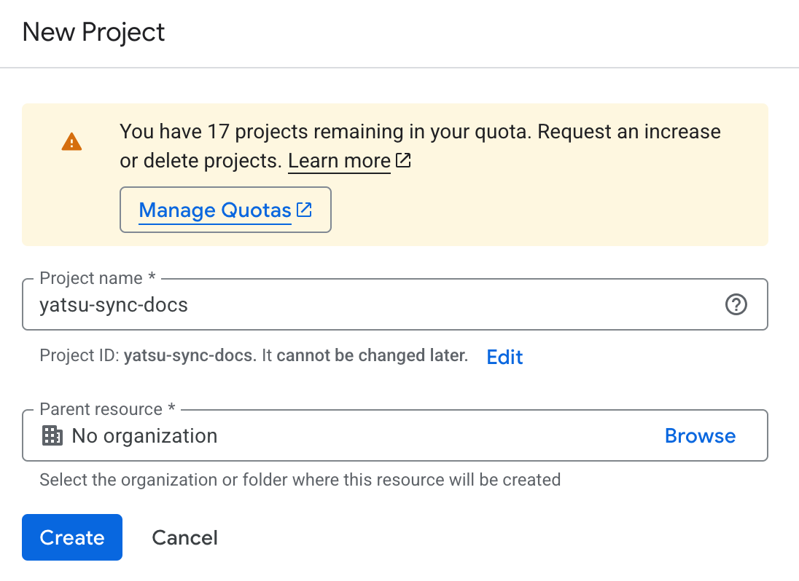

You will be automatically redirected to the project page:

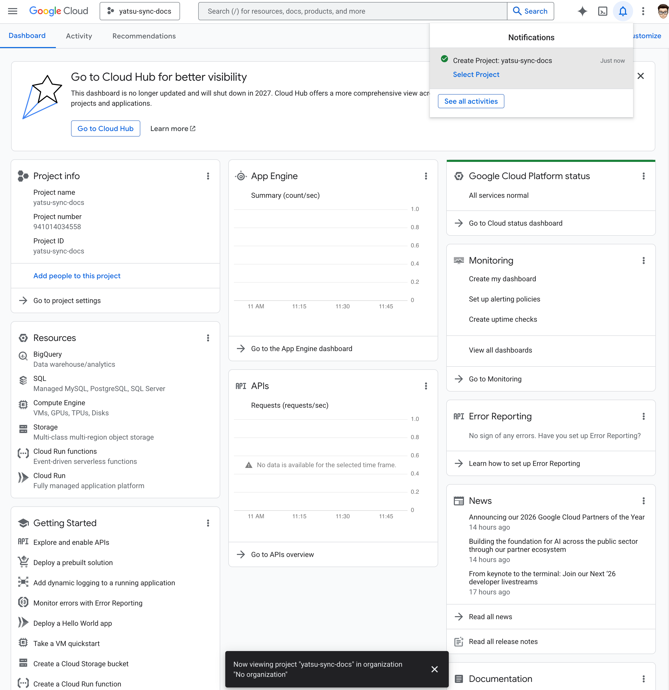

Click on the three lines at the top left to open the sidebar. Hover over "APIs & Services" and then click on "Enabled APIs & services":

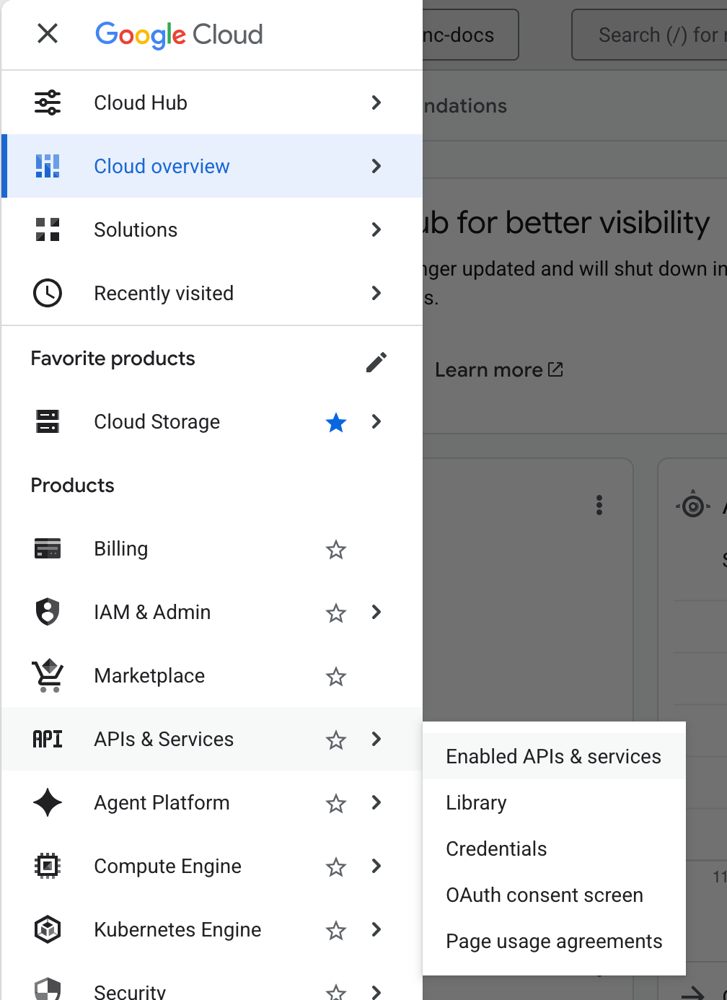

Click on "+ Enable APIs and services":

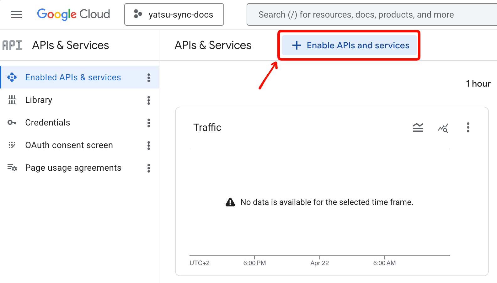

In the search box, write "Google Drive" and press on Enter.

Then, click on "Google Drive API":

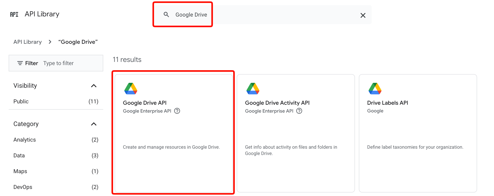

Click on the blue Enable button that appears.

You will be redirected to the Google Drive API details. From that screen, click on "OAuth consent screen":

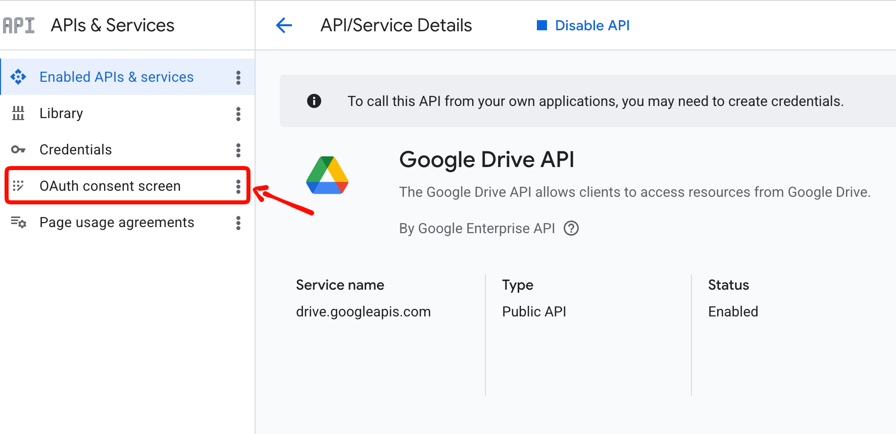

Click on the blue "Get started" button in the middle. This screen will appear:

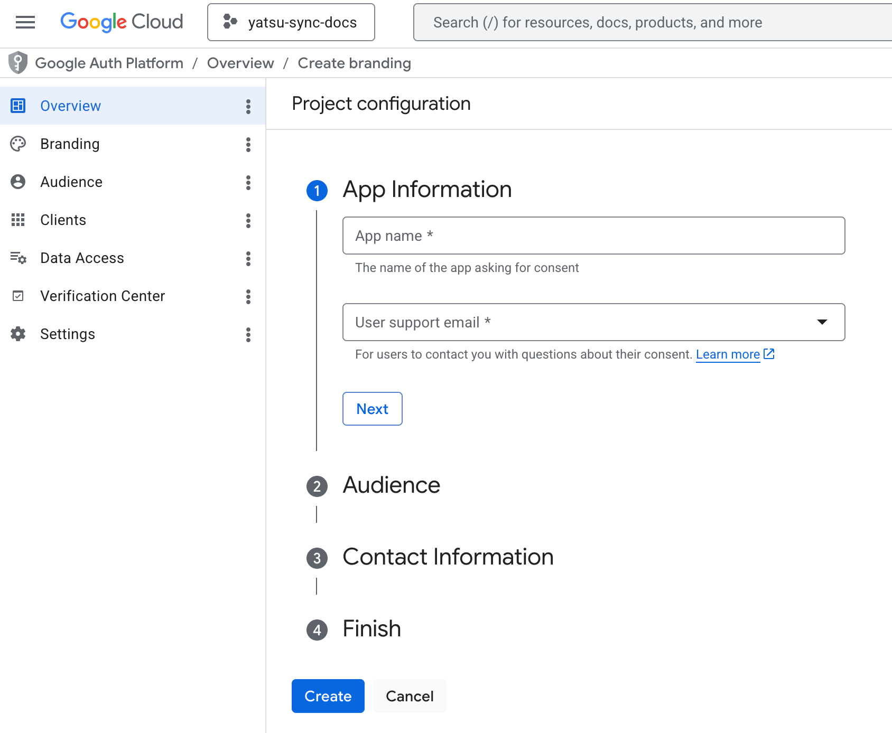

In "App name", you can write whatever you want.

In "User support email", pick your own email from the list.

Click on "Next".

From "Audience", click on "External", then click on "Next".

In "Contact Information", enter your own email, then click on Next.

In "Finish, click on the checkbox to agree to the terms, then click on "Continue".

Click on "Create".

You will be redirected to this page:

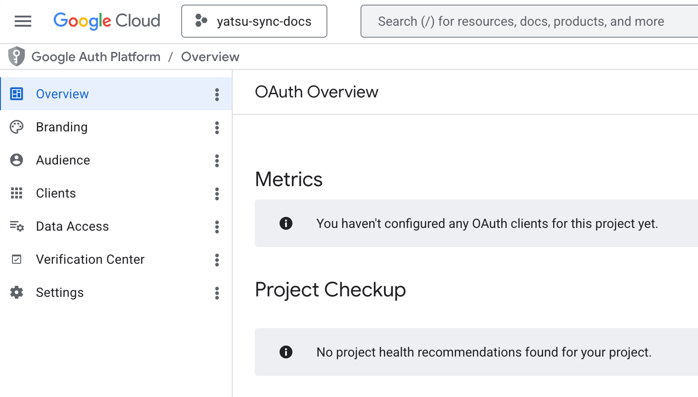

Click on "Data Access" on the left.

From the new page that appears, click on the white "Add or remove scopes" button. A table will appear from the right side.

Click on the text area next to "Filter" and write "drive.file". Then click on the only option that appears. This will filter the table to only show the "Drive file" scope.

Click on the checkbox next to the only row that appears, then click on "Update" at the bottom:

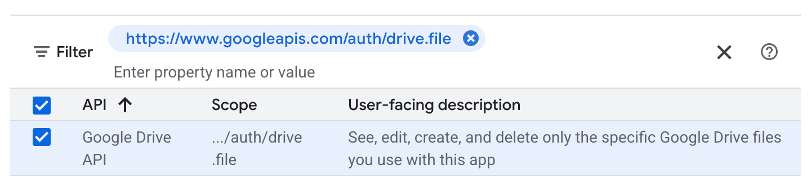

The table will close, and you will see the page you were on before. Click on the "Save" button at the bottom to save:

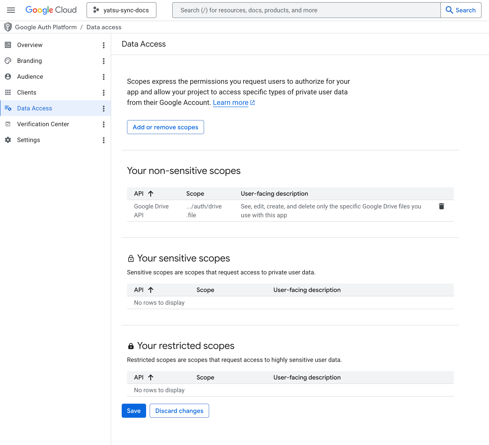

From the sidebar on the left, click on "Clients".

Click on "+ Create client".

From "Application type", pick "Web application".

This screen will appear:

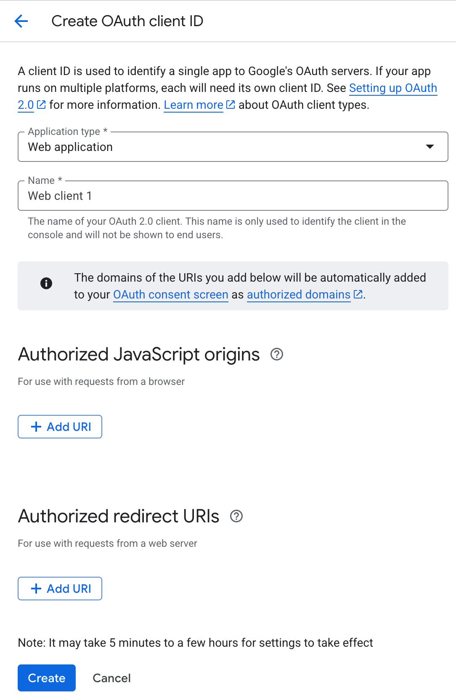

In "Name", pick anything you want. "Yatsu" is ok for example.

Under "Authorized JavaScript origins", click on "+ Add URI" and enter the `https://app.yatsu.moe` URL.

Under "Authorized redirect URIs" click on "+Add URI" and enter `https://app.yatsu.moe/auth`.

Click on the blue "Create" button at the bottom of the page.

You will see a dialog pop up, where you will see your Client ID and your Client secret. Save and store them somewhere, we will need them later in Yatsu:

!!! Important
    Once you close this dialog, you will not be able to see your client secret again, which you will need. So please take note of it somewhere and store it. If you lose your secret, you will not be able to connect Yatsu to Drive.

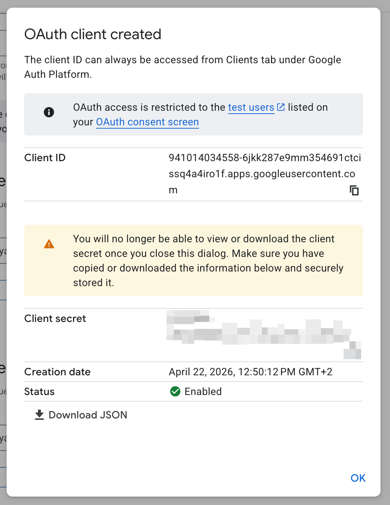

Lastly, click on "Audience" on the left, and then click on "Publish app".

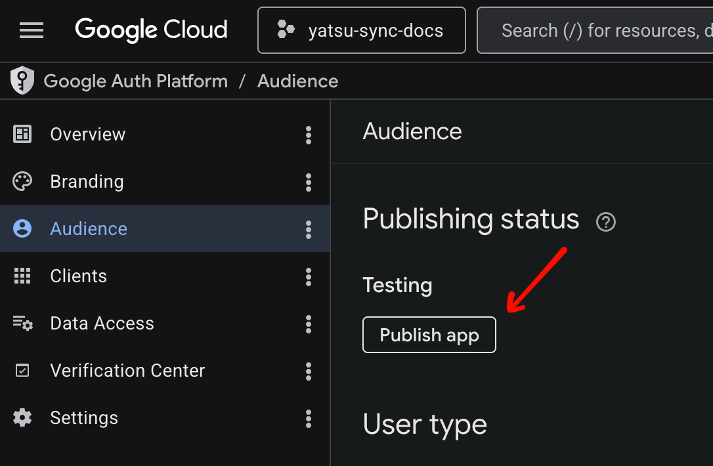

That's it when it comes to the Google side. Now, in Yatsu, go to Settings, and then click on "Data". Scroll down to "Sync and Sources" and open that box. Then, click on "+ Add":

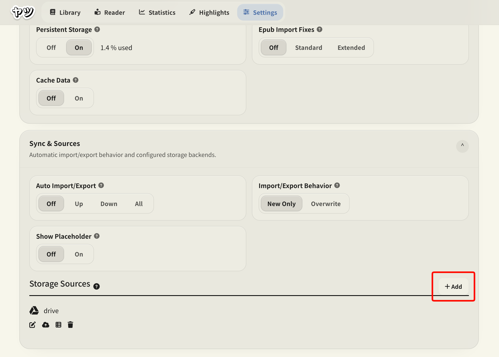

This dialog will appear:

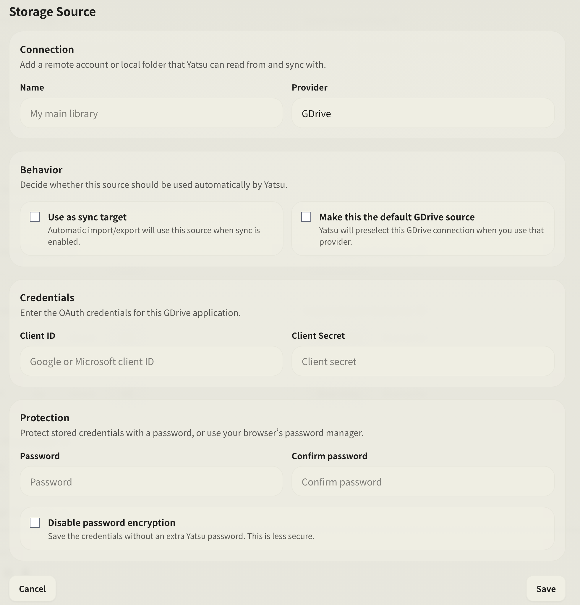

In Name, put whatever you wish.

Pick "GDrive" from the provider dropdown.

In "Behavior", pick whatever behavior suits you best.

In "Credentials", enter the Client ID and Client Secret that we stored before.

In Protection, you may optionally set a password which will be asked by Yatsu every single time you load books.

Click on "Save".

From Yatsu's library, you can now select your storage source and see the books that have been stored there:

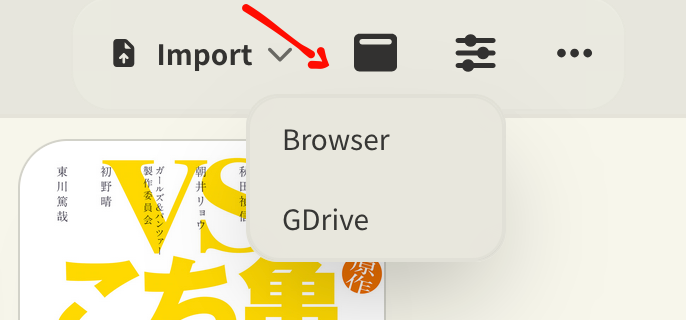

That's it.
