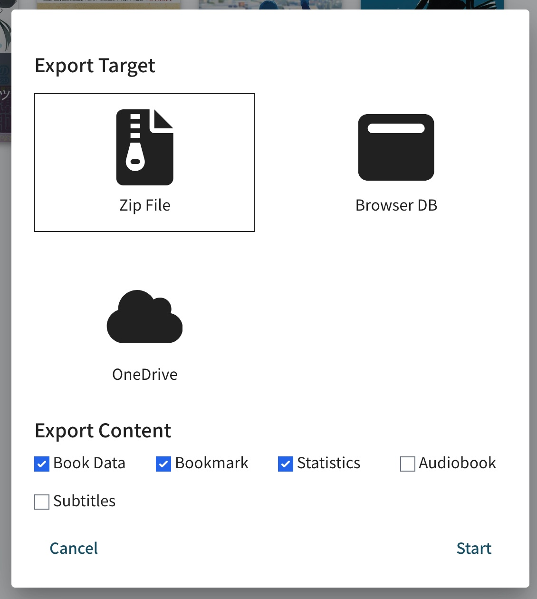

# Migrating from Ttsu to Yatsu

Yatsu can import a backup zip exported from ttsu. This is the safest way to move a ttsu library into Yatsu because the export is a normal downloaded file: you can keep it as a backup, move it to another device, and import it into whichever Yatsu storage source you want to use.

Use this guide if you currently read in ttsu and want to move your books, reading positions, and reading history into Yatsu.

## Short version

1. In ttsu, select the books you want to move.
2. Click the export button in the library header.
3. Choose **Zip File** as the export target.
4. Select the content you want to include, usually **Book Data**, **Bookmark**, and **Statistics**.
5. Click **Start** and save the downloaded `.zip` file.
6. In Yatsu, choose the library or storage source you want to import into.
7. Open **Import** -> **Import Backup**.
8. Select the `.zip` file exported from ttsu.

After the import finishes, the books should appear in the selected Yatsu library.

## Before you start

Keep the exported zip file until you have checked the imported library in Yatsu. If something goes wrong, that file is the easiest copy to retry from.

Do not clear ttsu site data before exporting if your books are stored in ttsu's browser storage. Browser storage belongs to the ttsu website origin, so Yatsu cannot read it directly. The zip export is what moves that local browser data across.

If your ttsu library is stored in Google Drive or OneDrive, open ttsu while online and make sure the books you want are visible before exporting. The export can only include data that ttsu can read from the selected source.

!!! tip

    If you want a one-time migration, use the backup zip workflow on this page.

    If you want to intentionally keep using the same custom ttsu-compatible cloud folder from both apps, read [Compatibility with Ttsu](ttsu-compatibility.md) too.

## Export from ttsu

1. Open ttsu and go to the library.
2. Select the book cards you want to move.

   A selected book shows a check mark on its cover. Select every book you want in the exported backup.

3. Click the export button in the library header.

   In the ttsu UI this is the cloud/upload-style button near the top right of the library.

   

4. In **Export Target**, choose **Zip File**.

   Do not choose **Browser DB** for this migration. That writes to the current ttsu browser database instead of giving you a portable backup file that Yatsu can import.

   

5. In **Export Content**, choose what to include.

   For a normal migration, select:

   - **Book Data**
   - **Bookmark**
   - **Statistics**

   Also select **Audiobook** and **Subtitles** if you used those features in ttsu.

6. Click **Start**.
7. Save the downloaded `.zip` file somewhere you can find it.

The downloaded file is the backup you will import into Yatsu. Do not unzip it first.

## Import into Yatsu

1. Open [Yatsu Reader](https://app.yatsu.moe).
2. Go to the library.
3. Choose the Yatsu storage source you want to import into.

   For example:

   - choose **Browser** if you want the migrated library stored locally in this browser
   - choose **Google Drive** or **OneDrive** if you have already connected that source in Yatsu and want the imported books stored there

4. Open the **Import** menu in the library header.
5. Choose **Import Backup**.

   Use **Import Backup**, not **Import File(s)**. The ttsu export is a Yatsu/ttsu backup zip, not a single EPUB, HTMLZ, or text file.

6. Select the `.zip` file you exported from ttsu.
7. Keep the Yatsu tab open until the import finishes.

When the import completes, the imported books should appear in the current Yatsu library. Open a few books and check that the current position and statistics look right before deleting anything from ttsu.

## What gets imported

Yatsu imports the parts that are present in the backup zip. If you did not select a content type during export, Yatsu cannot recreate that part later.

| ttsu export option | What Yatsu imports | Notes |
| --- | --- | --- |
| **Book Data** | The books themselves, stored book content, title, series, tags, cover data, character counts, sections, and other library metadata. | Select this if you want the books to appear in Yatsu without importing the original EPUB/HTMLZ/TXT files again. |
| **Bookmark** | The current reading position and progress for each book. | In ttsu, **Bookmark** means the main saved position. In Yatsu this becomes the book's current reading position. |
| **Statistics** | Reading history such as daily entries, reading time, characters read, reading speed data, and book completion markers. | These entries feed Yatsu's Statistics page. Yatsu's statistics merge setting controls how imported statistics combine with existing local statistics. |
| **Audiobook** | Linked audiobook state and playback position, if present. | This does not move an external audio file that lives outside ttsu. |
| **Subtitles** | Stored subtitle data and subtitle state, if present. | Use this if you used subtitle-linked workflows in ttsu. |

Backup imports can also restore extra Yatsu-compatible data if the zip contains it, such as saved bookmarks, highlights, highlight notes, reading goals, and cover images. Older ttsu exports may not contain all of those newer Yatsu-specific files.

Yatsu's own **Get complete local backup** zip can also contain a versioned
safe settings snapshot. That settings snapshot is restored only when importing
into the Browser storage source. Older ttsu backup zips do not contain this
Yatsu settings file.

## What does not get imported

The backup zip is for library and reading data. It does not import everything about your app setup.

These are not moved by the ttsu backup import:

- ttsu or Yatsu account sign-in
- Google Drive or OneDrive authorizations
- custom storage source credentials
- reader appearance settings and app settings from ordinary ttsu backup exports
- browser/PWA install state
- browser extension or userscript settings
- uploaded local font files
- files that were not included in the ttsu export

After migrating, review Yatsu settings separately. If you want future reading statistics to be recorded in Yatsu, make sure **Settings** -> **Tracking** -> **Enable Statistics** is on.

## Existing Yatsu data

Importing a backup writes into the currently selected Yatsu storage source.

If a matching title already exists in that storage source, Yatsu uses your current import/sync behavior and merge settings. By default, Yatsu avoids blindly replacing newer existing book data, and statistics are merged with existing statistics.

For the cleanest first migration, import into an empty Yatsu library or make a backup of your current Yatsu data first.

## If something looks wrong

### The zip does not appear in the file picker

Choose **Import Backup** in Yatsu. **Import File(s)** is only for normal book files such as EPUB, HTMLZ, and TXT.

### The books imported, but reading positions did not

Check that **Bookmark** was selected when exporting from ttsu. In ttsu, that checkbox controls current reading position data.

If you imported progress without **Book Data**, Yatsu can only attach that progress to books it can match in the target library.

### The books imported, but statistics are missing

Check that **Statistics** was selected when exporting from ttsu.

Also check the Statistics page's title and date filters. Imported statistics are stored by book title and date, so a restrictive filter can make imported entries look hidden.

### The import failed partway through

Keep the exported zip file and do not clear ttsu site data yet.

Try the import again after reloading Yatsu. If it still fails, report the error message and mention that the file came from a ttsu backup export.

### The backup is very large

Large libraries can take a while to export and import, especially on mobile. Keep both tabs open while the operation runs. If a mobile browser struggles, export and import from a desktop browser when possible.
