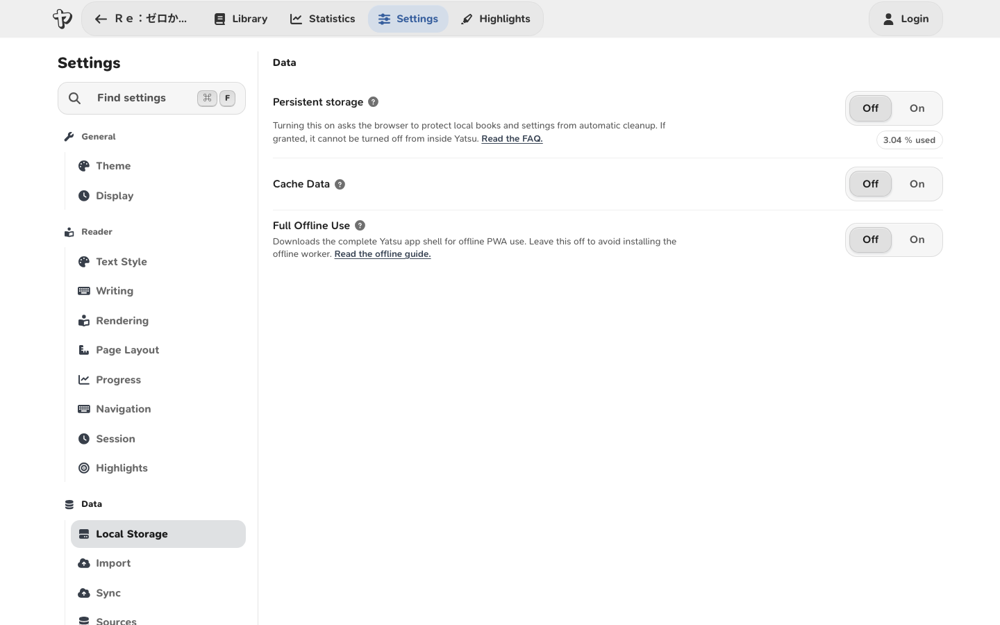

# Using Yatsu Offline

To read offline, this browser needs both Yatsu's app files and the books you
want to read. A title listed in a cloud library is not enough: the book's
content must be stored on the device.

<span id="short-version"></span>
<span id="the-app-needs-to-be-saved-while-online"></span>

## Preparing books for offline reading

While online:

1. Open [**Settings** > **Data**](https://app.yatsu.moe/settings?section=data).
2. Turn on **Full Offline Use** and wait until Yatsu says it is saved for offline use.
3. Open each book you need and wait for its content and any sync to finish loading.
4. Turn on **Persistent storage** if your browser allows it.
5. If you use the installed PWA, close and reopen it while still online.
6. Disconnect from the internet and check that Yatsu and your books open.

Use the same browser profile or installed app when reading offline. Books
imported into **Browser** storage are already local to that browser profile.

## Offline settings

All three settings are under **Settings** > **Data**.



<span id="full-offline-use-setting"></span>
<span id="persistent-storage"></span>
<span id="cache-data-setting"></span>

| Setting | What it does | Limits |
| --- | --- | --- |
| **Full Offline Use** | Downloads Yatsu's complete app files while online, shows progress, and saves future app updates while enabled. | Off by default. It does not download books; open each book you need separately. |
| **Persistent storage** | Asks the browser to protect local data from automatic cleanup when space is low. | The browser decides whether to grant it. It does not protect against manually clearing site data or losing the device. |
| **Cache Data** | Reuses storage listings and files to reduce repeated requests. | Changes from another device may need a reload or new tab to appear. It does not prepare the complete app for offline use. |

With **Full Offline Use** off, Yatsu still caches some app files as you use it.
Recently visited screens may work offline, but every screen may not be available.
With **Cache Data** off, Yatsu requests fresh storage data more often.

!!! warning

    Keep a backup or synced copy of important books and reading data. Clearing
    site data for `app.yatsu.moe` can remove local books and progress even when
    Persistent storage is enabled.

## What should work offline

Once the app and book content are stored locally, you can read, save progress,
use local settings, and record reading statistics.

## What does not work offline

Cloud services need a connection to list or fetch new books, upload changes,
import or export data, and complete sign-in. Yatsu cannot perform these operations
offline.

A cloud book may show this message:

```text
Sync disabled due to missing Online Connection - refresh Page after going Online to try again
```

The message reports a failed connection to the sync source. If the full book
content is cached locally, you can still read it.

## Browser, Google Drive, OneDrive, and filesystem sources

| Source | Offline availability |
| --- | --- |
| **Browser** | Books are stored in the current browser profile. |
| **Google Drive / OneDrive** | Previously cached books can be read locally. Fetching books, refreshing listings, and syncing need a connection. |
| **Filesystem** | Local files may work offline, but the browser can ask you to grant folder access again. Support depends on the browser and device. |

## Syncing after being offline

Progress, bookmarks, highlights, statistics, goals, and metadata changes stay
local until sync runs. After reconnecting, refresh Yatsu or reopen the book if
sync has not restarted, then wait for it to finish.

If another device changed the same data, your merge settings determine how the
copies combine. See [Statistics and Sync](statistics-and-sync.md) and
[Syncing and exporting tracking data](reading-tracking.md#syncing-and-exporting-tracking-data).

## FAQ

### Do I have to install Yatsu as a PWA?

No. A browser tab can work offline once the app and book files are saved.
Installing the PWA does not replace the preparation checklist above.

### Why do I see the browser's "You're offline" page?

Check that you prepared Yatsu in this browser profile or installed app:

1. Reconnect to the internet and open Yatsu.
2. Open **Settings** > **Data** and enable **Full Offline Use**. If it is already
   enabled, turn it off and on again.
3. Wait for saving to finish, then reopen Yatsu. Reopen the installed PWA too if you use it.
4. Disconnect and test again.

If it still fails, [report the problem](how-to-report-bugs.md) with your browser,
device, and any error shown while saving for offline use.

### Why does Ttsu open offline but Yatsu does not?

The browser stores the two sites separately. Having Ttsu saved offline does not
save Yatsu. Use the checklist above to prepare and test Yatsu in this browser.

### Can I import new books while offline?

Importing local files into **Browser** storage may work offline if the app files
needed for import are cached. Cloud imports need a connection. Prepare books
before going offline when you need to be sure they are available.

### Can I rely on browser storage as my only copy?

Keep another copy of important books and progress. From the Library, choose
**More library actions** > **Get complete local backup** to download a ZIP of
local books, reading data, and supported settings. Restore it with
**Import** > **Import Backup**. See [Complete local backups](library.md#complete-local-backups)
for what is included.

To remove local data, see [Delete all local Yatsu data](faq.md#how-do-i-delete-all-local-yatsu-data-from-this-browser).
