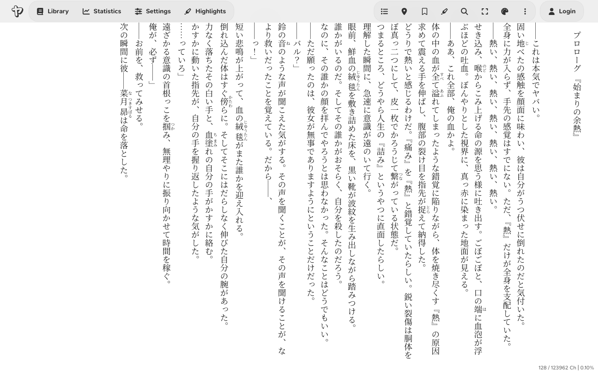
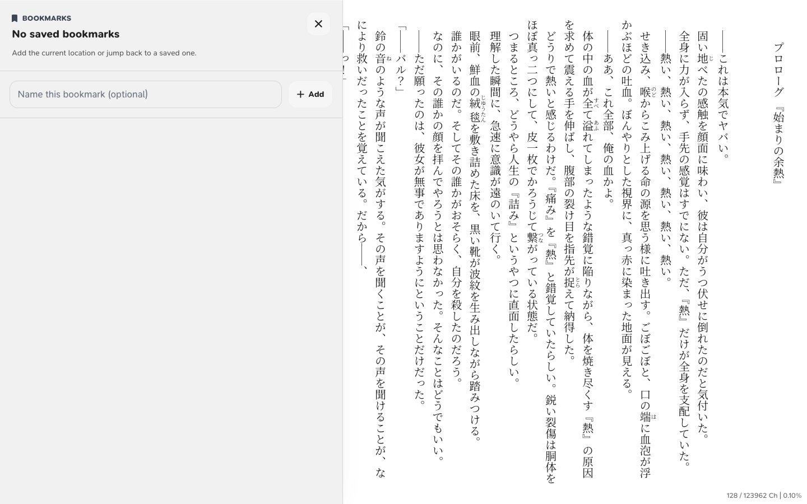
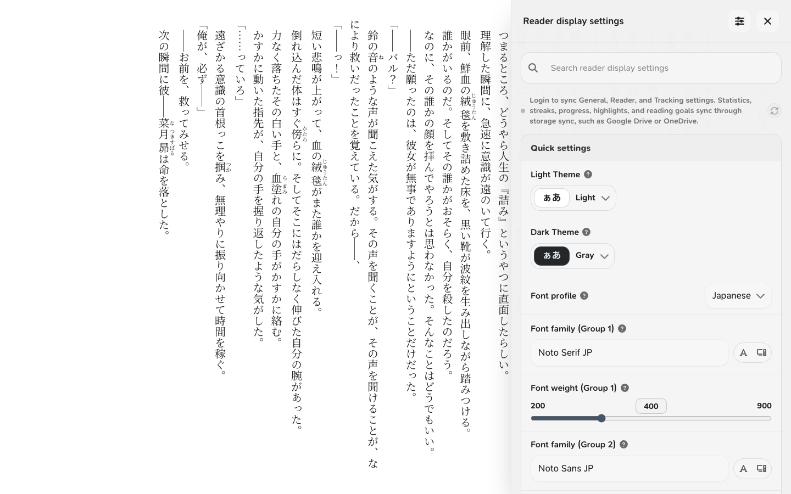
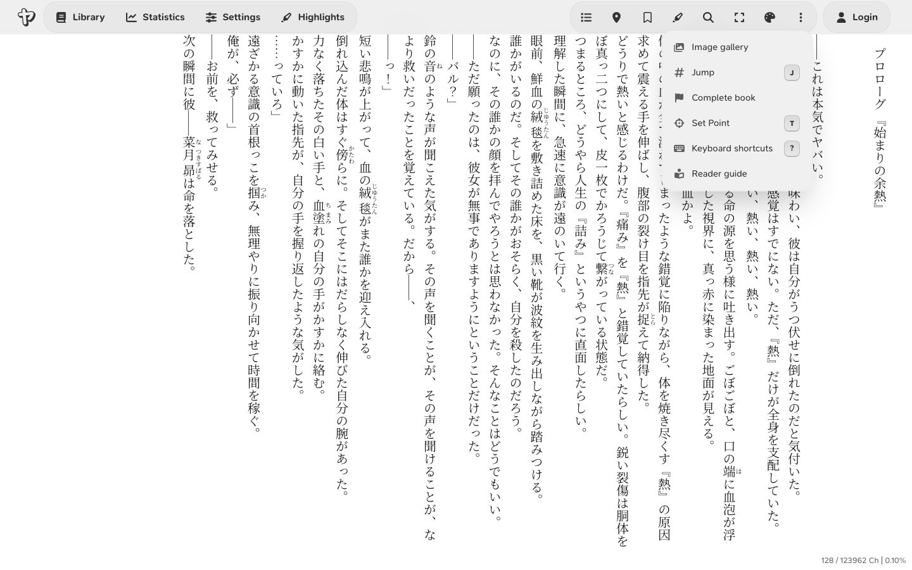

# Using the Reader

Open a book from the Library to read it. Use the reader toolbar to navigate,
save positions, add bookmarks and notes, or adjust the text.

## Main Reader Controls

Click or tap the upper area of the page to open the reader toolbar.

Depending on screen size and book type, some actions may move into the **More reader actions** menu.

Common controls include:

- **Table of contents**: opens the book's chapter list, if Yatsu can find one.
- **Save current position** or **Update current position**: saves the current reading position Yatsu uses for progress and returning later.
- **Bookmarks**: opens the saved bookmarks drawer, where you can add, name, rename, delete, and jump to bookmarks.
- **Highlights**: opens the saved highlights drawer for the current book.
- **Notes**: opens plain book notes for the current book. These notes are not tied to a specific passage.
- **Return to current position**: jumps back to your saved current reading position, if one exists. This action is in **More reader actions**.
- **Current autoscroll speed**: shown in continuous mode when autoscroll is available.
- **Fullscreen**: toggles browser fullscreen.
- **Zen mode**: hides the reader chrome, footer, clock/session overlay, and reading position markers until you press `Z` again or click the pale `Z` in the bottom-right corner.
- **Appearance**: opens the live appearance panel for reader-specific visual settings.
- **More reader actions**: opens less frequent reader actions such as completion, custom point controls, image gallery, and keyboard shortcuts.

## Moving Through a Book

Yatsu has three reader modes: paginated, continuous, and VN.

In paginated mode:

- Use the page controls, tap edges, or keyboard shortcuts to move page by page.
- You can also use a [connected controller](#controller-navigation) in supported browsers.
- Use **Table of contents** to jump between chapters.
- Left and right arrow keys turn toward the corresponding screen edge. The reading direction determines which edge advances the book.

In continuous mode:

- Scroll normally.
- A [connected controller](#controller-navigation) can scroll in supported browsers.
- Autoscroll can move the text for you.
- The speed indicator shows the current autoscroll multiplier.

In VN mode:

- Yatsu shows one reader block at a time by default, such as a paragraph, heading, list, table, or image.
- Use `Space`, `Enter`, `PageDown`, `ArrowDown`, or the visible reader controls to move forward. Use `PageUp`, `ArrowUp`, or the opposite horizontal arrow to move back.
- **VN reveal speed** controls the typewriter-style reveal speed. Set it to Instant to show each screen immediately.
- Set **VN screen content** to **Sentences** to choose how many sentences appear on each screen. Images, lists, and tables still stay together as whole blocks.

The default reader shortcuts include:

| Action                    | Shortcut                           |
| ------------------------- | ---------------------------------- |
| Previous page             | `PageUp` / `ArrowUp`               |
| Next page                 | `PageDown` / `Space` / `ArrowDown` |
| Flip toward left edge     | `ArrowLeft`                        |
| Flip toward right edge    | `ArrowRight`                       |
| Previous chapter          | `N`                                |
| Next chapter              | `M`                                |
| Toggle autoscroll         | `S`                                |
| Increase autoscroll speed | `A`                                |
| Decrease autoscroll speed | `D`                                |
| Search current book       | `/` / `Ctrl+F` / `Cmd+F`           |
| Toggle fullscreen         | `F`                                |
| Toggle Zen mode           | `Z`                                |
| New book note             | `Shift+N`                          |
| Show keyboard shortcuts   | `?`                                |
| Exit reader               | `Esc` twice                        |

!!! note

    Keyboard shortcuts are ignored while many dialogs and menus are open, and while you use modifier keys such as Ctrl or Alt.

## Current Reading Position and Bookmarks

Yatsu separates the **current reading position** from user-created **bookmarks**.

The **current reading position** is the saved location used for book progress
and returning later. Use **Save current position** or **Update current position**
to store it, then **Return to current position** to jump back.

Bookmarks are separate saved locations. Open **Bookmarks** to show the drawer, where you can:

- add a bookmark at the current location
- give a bookmark an optional name
- jump to a saved bookmark
- rename or delete a bookmark from the row actions menu

Saved bookmark markers appear in the reader. When the header is closed, clicking or tapping a bookmark marker opens a small rename/delete flyover for that bookmark.

The default shortcuts are:

| Action                             | Shortcut  |
| ---------------------------------- | --------- |
| Open bookmarks drawer              | `B`       |
| Add a quick bookmark               | `Shift+B` |
| Save current reading position      | `O`       |
| Return to current reading position | `R`       |

If text selection bookmarking is enabled in settings, Yatsu can use the selected text location when creating a current reading position or bookmark. Otherwise, it uses the current reader position.

To save a specific place on the visible page, use **Set Point** first. See
[Custom reading point](#custom-reading-point).

Current reading position is stored with progress data. Multiple bookmarks are stored separately and can be synced or exported with your reading data when the relevant sync/export options are enabled.

## Highlights, Notes, and Quote Images

Select text in the reader to open the highlight pill. Pick a color to save a highlight, or choose the image button to turn the selected passage into a shareable quote image without saving a highlight first.

Saved highlights can also create quote images. Click or tap highlighted text in the reader, then choose the image button from the highlight actions pill. You can also open the **Highlights** drawer and choose **Quote image** from a saved highlight's actions menu.

Use **Notes** in the reader header to create plain text notes for the current
book without selecting a passage. Notes can include an optional title. Press
`Shift+N` to open a new note quickly. Book notes appear in the reader Notes
drawer and on the app-level **Notes** page. The Notes page opens to the
Highlights tab by default and has a second tab for plain notes.

Highlights and book notes can be exported, included in complete local backups,
and synced through supported storage sources when those data types are selected.

The quote image dialog shows a preview and can create a full-resolution PNG. Use **Share image** when your browser supports the system share sheet, **Copy** to copy the PNG to the clipboard, or **Download image** to save it. The quote text follows your current reader font, including language-specific reader font profiles.

Everyone can use the default square quote image with book attribution. Supporters can customize the image size, quote size, quote direction, quote alignment, background color, uploaded background image, book-cover background, background opacity, blur, position, and optional display name. Vertical quote direction lays the quote out in columns that start on the right and continue left.

Quote images are generated in your browser. The selected text and custom images are not uploaded to Yatsu servers to create the PNG.

## Table of Contents

The table of contents appears when the book includes chapter data that Yatsu can read.

Open **Table of contents** and choose a chapter to jump to it. The control is
hidden if Yatsu cannot read chapter data from the book.

## Custom Reading Point

The custom reading point tells Yatsu which part of the screen should count as your reading position.

Yatsu uses this point when calculating progress, saving positions and bookmarks,
and tracking character movement.

Use **Set Point** from the reader actions menu to choose the point. If a point already exists, the menu can also show **Show Point** and **Reset Point**.

The default shortcut is:

| Action                   | Shortcut |
| ------------------------ | -------- |
| Set custom reading point | `T`      |

### Save the current reading position at a screen location

Use this when the saved current position should match the line or area you are actually reading.

1. Open the reader action menu.
2. Choose **Set Point**, or press `T`.
3. Click or tap the place on the page that should count as your current reading position.
4. Choose **Save current position** or **Update current position**, or press `O`.

After that, **Return to current position** jumps back using the position calculated from that point.

### Add a bookmark at a screen location

Use this when you want a bookmark to point to a specific line or area on the visible page.

1. Open the reader action menu.
2. Choose **Set Point**, or press `T`.
3. Click or tap the place on the page where the bookmark should be anchored.
4. Open **Bookmarks** and add a bookmark, or press `Shift+B` to add a quick bookmark.
5. Rename the bookmark if you want a label for that location.

The bookmark uses the reading position calculated from the point you just set. If **Show Point** is available, you can use it to briefly reveal the active point before saving. Use **Reset Point** if you want to go back to the default reader position.

In paginated mode, Yatsu sets the point from the text location you choose on the current page. When you turn the page, that temporary point is cleared. In continuous mode, Yatsu uses a persistent screen position. Continuous mode requires **Settings** > **Reader** > **Custom Reading Point** to be turned on.

!!! tip

    If a bookmark lands ahead of or behind the line you wanted, use **Set Point** on that line before saving it.

## Appearance

The **Appearance** action opens live reader settings without leaving the book.

Use it for changes such as:

- font size and language-specific font profiles
- reader content language, including Simplified and Traditional Chinese glyph forms
- line height
- text margins
- vertical or horizontal writing behavior
- per-book character counting method for Japanese/Chinese or Korean progress
- page columns
- furigana display
- VN reveal speed and Supporter sentence grouping
- theme and custom theme adjustments
- publisher style handling

Changes apply to the open book immediately.

### Theme typography

Supporters can save typography directly on a custom theme from the theme maker.
Open a custom theme, turn on **Apply typography with this theme**, choose the
font settings to save, and save the theme. Whenever that theme becomes active,
Yatsu applies the saved typography automatically.

Themes without saved typography leave your current font settings alone. To stop a
theme from changing fonts, edit the theme, turn **Apply typography with this
theme** off, and save it again.

Theme typography can include font families, font weights, language font profiles,
and font size. Built-in fonts and Google Fonts can sync as settings. Uploaded or
installed fonts still need to exist on the device where you use the theme.

### Vertical text spacing

When **Writing mode** is set to vertical text, Yatsu shows extra text spacing controls:

- **Enable Font Kerning** lets the selected font fine-tune spacing between vertical characters when the font and browser support it. Leave it off if you want Japanese characters to stay on a stricter grid.
- **Proportional vertical spacing** uses the font's proportional vertical alternates when available. This can tighten kana and punctuation, but adjacent columns may no longer line up exactly. Turn it off when aligned Japanese columns are more important than compact spacing.

Even with both settings off, vertical Japanese text may not look like a perfect manuscript-paper grid. Japanese fonts use square character frames, but the visible glyph inside each frame can be narrower, wider, or intentionally off-center. Small kana such as `っ`, `ゃ`, `ゅ`, and `ょ`, punctuation, and half-width Latin numbers like `7` can look less centered than full-width Japanese characters. Browser font rendering, fractional pixels, and book-specific CSS can also make the optical spacing look slightly uneven.

This is usually normal. If you want the strictest alignment Yatsu can provide, keep both vertical spacing settings off, prefer full-width Japanese punctuation and numbers where the book provides them, and turn off publisher typography if the book's own CSS is adding spacing. Large unexpected gaps between ordinary full-width kana and kanji may still be worth reporting.

Yatsu normally uses the language stored in the book file. If Chinese text shows Japanese-style character variants, set **Reader content language** to **Simplified** or **Traditional** in the live appearance panel. This choice is stored locally for that book and is not synced by Yatsu Account Settings Sync. To use different fonts per language, choose **Font profile** in Appearance or **Settings** -> **Reader** -> **Text Style** and configure the Japanese, Simplified Chinese, or Traditional Chinese profile. For more detail, see [Chinese Support](chinese-support.md).

Yatsu counts Japanese and Chinese characters by default. For Korean books, set **Character Counting Method** to **Auto** or **Korean** in the live appearance panel. **Auto** only uses Korean counting when the book file declares Korean or the book text looks clearly Korean. This choice is stored locally for that book and is not synced by Yatsu Account Settings Sync. For more detail, see [Korean Support](korean-support.md).

Some layout changes can move your current position. Yatsu tries to preserve the current reading position, and the custom reading point can make that more predictable.

## Image Gallery

Some books contain images that Yatsu can collect into an image gallery.

When available, **Image gallery** appears in the reader actions menu.

Inside the gallery:

- move between images with the gallery controls
- use page or arrow shortcuts to move between images
- press `Esc` to close the gallery
- spoiler controls may appear if image spoiler settings are enabled

If the current book has no collected images, this action may not appear.

## Reading Tracking

If **Enable Statistics** is turned on, the tracker icon appears in the reader.

The tracker can record:

- reading time
- characters read
- reading speed
- book completion data
- reading goal progress

Useful defaults:

| Action                   | Shortcut |
| ------------------------ | -------- |
| Toggle tracking          | `P`      |
| Freeze tracking position | `E`      |

Use **Freeze tracking position** when you are about to jump around and do not want that movement counted as normal reading.

For more detail, see [Reading Tracking and Statistics](reading-tracking.md).

## Completing a Book

The reader actions menu includes **Complete book**.

Use it when you want Yatsu to record that the book is finished. Depending on your tracking settings, Yatsu may also open the tracker menu or add the remaining character count to the completion entry.

Completion data can appear in statistics and can be affected by tracking settings such as **Overwrite Book Completion** and **Update on Completion**.

## Leaving the Reader

Pressing `Esc` once shows a warning. Pressing `Esc` again within a few seconds returns to the library.

You can also return to the library from the app navigation.

If close confirmation is enabled and your current reading position has not been saved, Yatsu may ask for confirmation before leaving.

## Controller navigation

In supported browsers, you can also use a connected controller for navigation.
The standard layout uses D-pad left or L1/LB for previous page and D-pad right
or R1/RB for next page. A/Cross saves the current reading position, and
B/Circle asks to exit the reader. Press the exit binding again within the
confirmation window to return to the library. Open **Controller navigation**
from Settings or the live reader settings panel to rebind the controller
inputs, tune the stick deadzone, or add optional bindings for auto-scroll
controls, toggling the table of contents, and the reading tracker panel.

In supported browsers, either controller stick can scroll continuously. Push
down or up in horizontal text, and left or right in vertical text. The farther
you push the stick, the faster Yatsu scrolls. If the reader moves while the
sticks are centered, raise the stick deadzone in **Controller navigation**.

## Volume-button page turns on Android

??? info "Android volume-button setup (advanced)"

    A webpage cannot normally read a phone's volume buttons. Android users can work
    around this by using [Key Mapper](https://github.com/keymapperorg/KeyMapper) to
    convert the volume buttons into the `PageUp` and `PageDown` keyboard shortcuts
    that Yatsu already supports.

    This is an advanced, Android-only workaround. It requires a third-party app with
    accessibility or system-level permissions, and it is not available on iPhone or
    iPad. Only continue if you are comfortable granting those permissions.

    On Android 11 and newer, Key Mapper recommends using
    [Shizuku](https://shizuku.rikka.app/guide/setup/) for its **Input key code**
    action. After starting Shizuku, enable it from **Key Mapper** > **Settings** >
    **Shizuku support** and approve the permission request. Key Mapper's
    [Shizuku guide](https://docs.keymapper.club/user-guide/shizuku/) explains the
    connection in more detail.

    Then create two key maps:

    1. Use **Volume Up** as the trigger and **Input key code** > `KEYCODE_PAGE_UP`
       as the action. This turns to the previous page.
    2. Use **Volume Down** as the trigger and **Input key code** >
       `KEYCODE_PAGE_DOWN` as the action. This turns to the next page.
    3. Add a constraint so each key map only runs while your browser, or the Yatsu
       PWA, is in the foreground. This leaves the volume buttons unchanged in other
       apps.
    4. Open a book in Yatsu and test both buttons. Swap the two key codes if you
       prefer the opposite direction.

    Shizuku may need to be started again after restarting the phone. If the buttons
    still change the volume but do not turn pages, check that Shizuku is running,
    that Key Mapper's accessibility service is enabled, and that the foreground-app
    constraint matches the browser actually displaying Yatsu. Browser and device
    behavior can differ, so this workaround is not guaranteed on every Android
    phone.

    Older community instructions used Kiwi Browser. Kiwi was archived in 2025 and
    is no longer maintained, so try this setup in your current Android browser
    first.

## When Controls Are Missing

Some reader controls only appear when they apply.

For example:

- **Table of contents** needs chapter data.
- **Return to current position** needs a saved current reading position.
- **Image gallery** needs collected images.
- **Fullscreen** depends on browser support and current context.
- **Tracking** needs statistics to be enabled.
- **Custom point** controls depend on reader mode and custom point settings.
