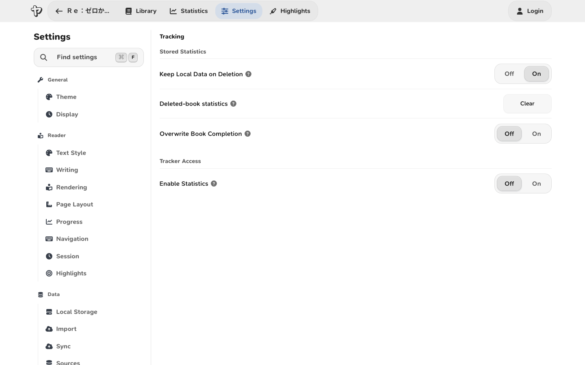
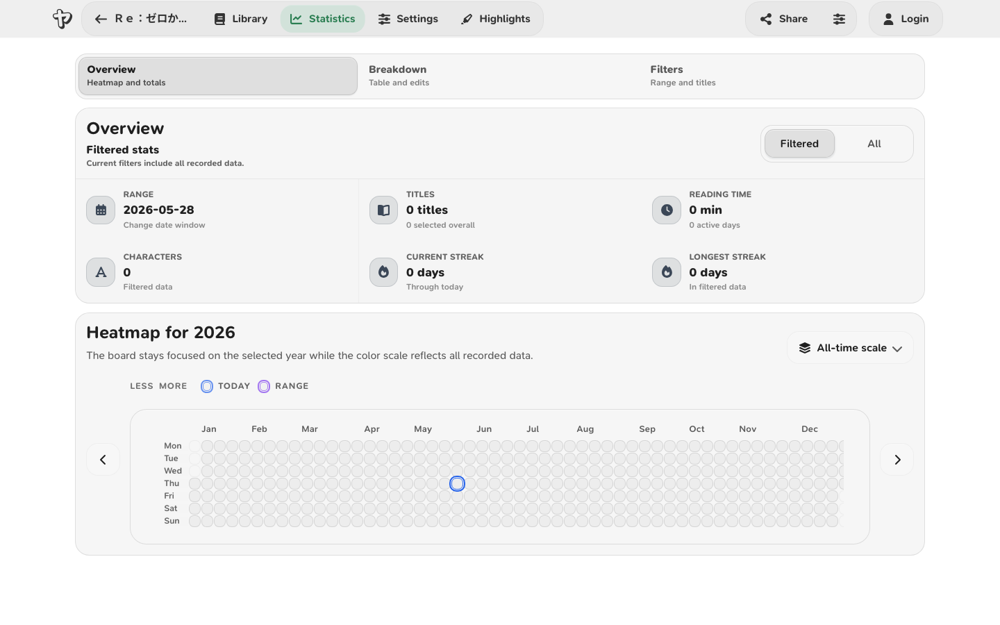
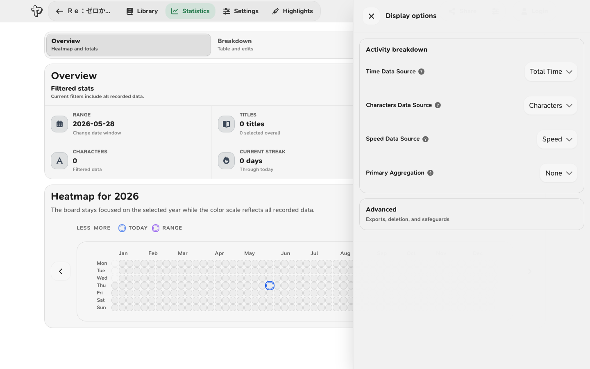

# Reading Tracking and Statistics

The reading tracker records time, character movement, reading speed, completion
dates, and progress toward your reading goals.

## Start tracking {#quick-version}

1. Turn on **Settings** > **Tracking** > **Enable Statistics**.
2. Open a book.
3. Press `P` or double-click the tracker icon in the bottom-left corner to start tracking.

Tracker controls:

- A red play icon means tracking is paused.
- A pause icon means tracking is running.
- Click the icon once to open the tracker menu.
- Double-click the icon to start or pause tracking without opening the menu.
- Press `P` in the reader to toggle tracking with the default keybind.
- Press `E` in the reader to toggle position freeze with the default keybind.

When the tracker is running, Yatsu updates reading time every second and compares your current character position with the previous tracked position. The difference becomes the characters read for the current session.

The character position uses the current book's character counting method. Japanese and Chinese counting is the default; Korean books can use the per-book **Character Counting Method** in the live appearance panel. See [Korean Support](korean-support.md) for setup details.

## What Yatsu Records

For each book and date, Yatsu can store:

- **Characters read**: the net character-position movement counted by the tracker.
- **Reading time**: seconds tracked while the tracker is running.
- **Reading speed**: characters per hour, calculated from characters read and reading time.
- **Minimum speed** and **maximum speed** values.
- **Book completion** data, if the book is marked complete.
- **Last modified** data used when syncing and merging statistics.

Yatsu also stores reading goals separately. A goal can have a time target, a character target, a frequency, and a start date.

## Privacy

Reading statistics stay in browser storage unless you export them or sync the **Statistics** data type to another storage source. Reading goals work the same way with the **Reading Goals** data type.

Yatsu Account Settings Sync does not sync reading statistics, reading goals, bookmarks, highlights, book notes, or book progress. It only syncs Reader and Tracking settings.

If you sync to an external provider, that provider receives the data types you choose to sync.

!!! note

    Statistics are based on the reader's character position, not on eye tracking or page visibility alone. If you leave the tracker running but do not move through the book, Yatsu will mostly add time, not characters.

## Starting and Stopping the Tracker

The tracker only appears in the reader after **Enable Statistics** is turned on.

When you open the tracker menu, Yatsu pauses tracking while the menu is open. If the tracker was running before you opened the menu, closing the menu resumes it.

The tracker menu contains:

- **Current Session**: what has been counted since the current tracker session started.
- **Today**: the current tracking day for the book.
- **All Time**: all stored statistics for the book.
- **Book Completion**: completion data, if the book has a recorded completion entry.
- **Autoscroller**: a temporary row shown while autoscroll data is available.
- **Recent History**: recent tracking updates, with time and character differences.

The menu actions are:

- **Play/Pause**: starts or pauses the tracker.
- **Update Position**: resets the tracker reference point to the current reader position.
- **Freeze Position**: temporarily protects the current position so a jump or layout change is not counted as normal reading progress.
- **Save**: saves pending statistics in this browser.
- **Revert Item** in Recent History: adds the opposite time and character change for that history entry.

Clicking some tracker values toggles blur for those values. This is meant for screenshots or streaming when you do not want to show exact numbers.

## How Time and Characters Are Counted

While tracking is running, Yatsu checks your position every second and adds the
elapsed time and character movement to the current session, today's total, and
the all-time total. It saves periodically and when you pause. Staying on the
same passage adds time without adding characters.

Reading speed is recalculated from the stored values:

```text
reading speed = characters read / reading time, shown as characters per hour
```

**Start Day Hours** determines which day receives the reading activity. For
example, setting it to `4` assigns reading before 4:00 a.m. to the previous day.

Yatsu does not count while the tracker is paused. It also pauses or skips position changes during actions such as opening full settings, leaving the reader, using some dialogs, resizing the reader, or using custom reading point controls.

## Tracking Settings

Open **Settings** -> **Tracking** to configure these options.



### Stored statistics and sync {#collection-sync}

These settings affect whether statistics exist, how they are stored, and how they merge with synced data.

| Setting                         | Default | What it does                                                                                                                                                         |
| ------------------------------- | ------- | -------------------------------------------------------------------------------------------------------------------------------------------------------------------- |
| **Keep Statistics on Deletion** | On      | Keeps local statistics when you remove a local book copy. This is useful if you plan to reimport or sync the book later.                                             |
| **Deleted-book statistics**     | Action  | Choose **Clear** beside this label under **Tracking** > **Statistics** to remove statistics for deleted local books.                                         |
| **Overwrite Book Completion**   | Off     | When off, Yatsu keeps the first recorded completion for a book. When on, completing the book again can move the completion marker to the latest completion.          |
| **Start Day Hours**             | `0`     | Changes when a tracking day starts. For example, `4` means reading before 4:00 counts toward the previous day.                                                       |
| **Statistics Merge**            | Merge   | Controls how statistics combine during sync. **Merge** keeps entries by date and prefers newer data. **Replace** lets the incoming dataset replace existing entries. |
| **Reading Goals Merge**         | Merge   | Controls how reading goals combine during sync. **Merge** combines compatible goal windows. **Replace** lets the incoming goal dataset replace existing goals.       |
| **Enable Statistics**           | Off     | Shows the tracker in the reader and enables statistics collection.                                                                                                   |

### Tracker

These settings appear after **Enable Statistics** is on.

| Setting                         | Default  | What it does                                                                                                                                                                                      |
| ------------------------------- | -------- | ------------------------------------------------------------------------------------------------------------------------------------------------------------------------------------------------- |
| **Tracker Auto Pause**          | Moderate | Controls focus-based auto-pause behavior. See the next section for the modes.                                                                                                                     |
| **Open Tracker on Completion**  | On       | Opens the tracker menu after you complete a book, so you can review completion data.                                                                                                              |
| **Update on Completion**        | Off      | When completing a book, adds the missing character count between your current position and the end of the book. Leave it off if you do not want book completion to create a large character jump. |
| **Autostart tracker (sec)**     | `0`      | If greater than `0`, the tracker starts automatically after the reader has had no page-change events for that many seconds. `0` disables autostart.                                               |
| **Idle Time (min)**             | `0`      | If greater than `0`, the tracker pauses after this many minutes without page changes, pointer movement, or text selection changes. `0` disables idle auto-pause.                                  |
| **Forward Skip Threshold**      | `2700`   | If a one-second update jumps forward by this many characters or more, Yatsu treats it as a skip instead of normal reading. `0` disables this threshold.                                                      |
| **Backward Skip Threshold**     | `2700`   | If a one-second update jumps backward by this many characters or more, Yatsu treats it as a skip instead of normal reading. `0` disables this threshold.                                                     |
| **Threshold Action**            | Ignore   | Appears when either skip threshold is enabled. **Ignore** keeps tracking but counts the jump as `0` characters. **Pause Tracker** pauses instead.                                                 |
| **Dictionary Detection**        | Off      | Attempts to detect Yomitan/Yomichan or jpdb-browser-reader popups and avoid unwanted auto-pauses while using them. For Yomitan, turn off **Security** -> **Use a secure container around popups**. **Use secure popup frame URL** can stay on. |
| **Rollback Statistics on Idle** | On       | Appears when Idle Time is greater than `0`. When on, Yatsu tries to subtract the idle period from the session before pausing. When off, the elapsed idle time can remain counted.                 |

### Tracker Auto Pause Modes

**Off** means Yatsu does not pause just because the tab, window, or focus changes. Idle Time can still pause the tracker if you set an idle limit.

**Moderate** pauses when the Yatsu page becomes hidden, such as when you switch tabs or minimize the browser. It resumes when the page becomes visible again, as long as the pause was caused by auto-pause and you had not manually paused first.

**Strict** pauses when the browser window loses focus. It resumes on focus when the pause was caused by auto-pause and you had not manually paused first.

Dictionary Detection changes how popup dictionaries interact with Moderate and Strict mode. With detection enabled, Yatsu tries not to treat dictionary lookup focus changes as a reason to pause. With detection disabled, dictionary popups may pause the tracker under auto-pause behavior.

Yatsu also counts detected popup dictionary opens in reading statistics. This is a detected-popup count, not a guarantee that every dictionary lookup inside the extension was counted. Yomitan's **Use a secure container around popups** setting puts the popup iframe inside a closed shadow DOM, so Yatsu cannot discover the popup. The **Use secure popup frame URL** setting can remain enabled because Yatsu does not inspect the extension URL.

## Reading Goals

Reading goals are configured under **Settings** -> **Tracking** -> **Goals**.

To create or change a goal:

1. Turn **Enable Statistics** on.
2. Open **Settings** -> **Tracking** -> **Goals**.
3. Click **Edit** in the **Current Goal** panel.
4. Enter a time target, a character target, a reading speed target, or a combination of them.
5. Choose the goal frequency and start date.
6. Click **Save**.

A goal can include:

- **Time Goal (Min)**: target reading minutes.
- **Character Goal**: target characters read.
- **Reading Speed Goal (Ch/h)**: target reading speed in characters per hour.
- **Frequency**: Daily, Weekly, or Monthly.
- **Start Date**: when the goal starts.

Leave all goal values at `0` and save to clear the active goal. If you set a non-zero time, character, or reading speed goal, Yatsu needs a start date so it can place the goal in a window.

Goal frequencies work like this:

- **Daily**: one calendar tracking day.
- **Weekly**: seven-day windows based on the goal start day and the configured Start Day Hours.
- **Monthly**: thirty-day windows from the goal start date.

The tracker menu shows active goal progress when a goal applies to the current day. The Statistics page can also show a goal heatmap when reading goal data exists.

### Goal Progress Tracker

The **Goal Progress Tracker** setting is in **Settings** -> **Tracking** -> **Goals**. It controls the small progress light in the reader footer.

The progress light appears only when all of these are true:

- **Enable Statistics** is on.
- A reading goal is active for the current day.
- The **Goal Progress Tracker** setting is on.

The light uses these states:

- **Gray**: a goal is active, but Yatsu does not yet have enough data for the target currently driving the light.
- **Green**: the selected target is matching or ahead of the goal.
- **Yellow**: the selected target is close to the goal, but slightly under.
- **Red**: the selected target is materially behind the goal.

Click the light to open the progress details popover. The popover shows:

- the current goal window
- which target is driving the light
- time, character, and speed progress for every target included in the active goal
- whether each target is waiting, on track, close, or behind
- how many recent turns and how much tracked time the speed estimate is based on, when a speed goal is set

The **Dot tracks** control in the popover chooses which target colors the light. **Auto** is the default: it uses **Reading Speed Goal** when one exists, then falls back to **Character Goal**, then **Time Goal**. You can choose a specific available target instead.

When the light tracks speed, the estimate is based on forward page turns while the tracker is running. Yatsu compares the characters advanced with the tracked time since the previous forward movement, then smooths the most recent samples. Backward movement, large skips, pauses, and tiny samples are ignored so the light reflects current reading speed rather than navigation noise.

Temporary auto-pauses, such as popup dictionary detection, stop adding time to the speed sample but keep the latest light color visible. Manually pausing or jumping to another part of the book can reset the speed estimate to waiting.

The goal progress tracker uses the same local statistics and reading goal data as the tracker. It does not upload extra data by itself. Turn **Goal Progress Tracker** off to hide the light.

### Goal Sync and Maintenance

Reading goals have their own **Sync**, **Edit**, and **Reset** actions in the Reading Goals panel:

- **Sync** copies reading goals between configured storage sources.
- **Edit** changes the active goal.
- **Reset** deletes goals. If you delete goals and want that deletion reflected on another device, do a one-time sync using overwrite/replace behavior.

## Statistics Page Controls

The **Statistics** page shows a reading heatmap, an optional goal heatmap, title filtering, and a summary table.



### Date Range

Open **View options** on the Statistics page to adjust the range.

| Control                                      | What it does                                                                        |
| -------------------------------------------- | ----------------------------------------------------------------------------------- |
| **Template**                                 | Selects Today, This Week, This Month, This Year, or Custom.                         |
| **From** / **To**                            | Sets an exact date range. Changing either date switches the template to Custom.     |
| **Start of week**                            | Changes how weekly ranges and heatmap week labels are aligned.                      |
| **Set to all time for selected book titles** | Expands the date range to include all statistics for the currently selected titles. |

The Statistics page uses **Start Day Hours** from Tracking settings when calculating what "today" means.

### Activity Breakdown

The activity breakdown controls which values are displayed in the summary table.



| Control                    | Options                                             | Meaning                                                                                       |
| -------------------------- | --------------------------------------------------- | --------------------------------------------------------------------------------------------- |
| **Time Data Source**       | Total Time, Average Time, Weighted Time             | Chooses which time value appears in the table.                                                |
| **Characters Data Source** | Characters, Average Characters, Weighted Characters | Chooses which character value appears in the table.                                           |
| **Speed Data Source**      | Speed, Min Speed, Alt Min Speed, Max Speed          | Chooses which speed value appears in the table.                                               |
| **Primary Aggregation**    | None, Date, Title                                   | Chooses whether rows are individual date/title entries, grouped by date, or grouped by title. |

When aggregation is **None**, each row is one stored book/date entry. This is the mode where individual rows can be edited.

When aggregation is **Date**, Yatsu groups selected titles by date.

When aggregation is **Title**, Yatsu groups selected dates by book title.

For grouped rows:

- **Total** values are sums.
- **Average** values are averages across entries with reading time.
- **Weighted** values weight time and characters against each other, so large reading entries affect the result more than tiny entries.

### Sharing a Statistics Image

Open **Share** -> **Social image** on the Statistics page to create a PNG from the current activity breakdown.

The image starts from the same filtered data shown in the aggregated activity breakdown. If the page is filtered to This Week, a title subset, or a different aggregation mode, the share image uses that same selection.

In the dialog you can:

- Preview the PNG before saving it.
- Choose which statistics appear in the image.
- Pick a square image with one of the built-in pastel backgrounds.
- Download the PNG or copy it to the clipboard.

Supporters can also add custom title/content statistic rows, reorder those custom
rows, choose vertical or horizontal social sizes, use any background color,
import a local background image, use a local book cover as the background,
adjust fit/fill positioning, add a circular avatar, and show their Yatsu
username or a custom display name.

Imported background and avatar images stay in the browser while the dialog is open. They are used only to render the local PNG and are not uploaded or synced.

### Safeguards and Actions

The View options drawer includes:

- **Export selection**: exports the current filtered date/title selection.
- **Delete selection**: deletes the current filtered date/title selection.
- **Export all**: exports all loaded statistics.
- **Delete all**: deletes all loaded statistics.
- **Confirm Statistics Deletion**: asks for confirmation before statistics deletion.

Deleting local statistics does not automatically delete the same data from another storage source. To push deletions to another device or external source, run a one-time sync with overwrite/replace behavior.

### Title Filter

The title filter controls which books contribute to the Statistics page.

It can:

- Search titles by text.
- Select or deselect individual titles.
- Show only titles that have data in the current date range.
- Show only currently selected titles.
- Clear a prefilter when you opened Statistics from a specific book or library selection.

### Heatmaps

The reading heatmap shows reading activity by day. The goal heatmap shows reading-goal completion when goals exist.

Each heatmap can show:

- **All time** data, with year navigation.
- **Year** data for a specific year.
- Current streak and longest streak summaries.
- Day details when you hover or focus a heatmap cell.

The heatmap layout follows **Start of week** from Statistics view options.

## Syncing and Exporting Tracking Data

Tracking data is included in Yatsu's data types as **Statistics** and **Reading Goals**.

Statistics and goals are stored in this browser. Transfer them with a backup,
manual sync, or automatic storage sync. See [Statistics and Sync](statistics-and-sync.md)
for setting up multiple devices.

The two merge settings matter most when more than one device can change tracking data:

- Use **Merge** when you want Yatsu to combine local and remote entries and prefer newer entries where they overlap.
- Use **Replace** when you intentionally want one source to overwrite the other. This is usually the mode to use after deleting statistics or reading goals and wanting that deletion to propagate.

## Troubleshooting {#common-confusing-cases}

### The tracker is visible, but nothing is counting

Check these first:

- The icon is a pause icon, not a red play icon.
- **Tracker Auto Pause** has not paused because the tab or window lost focus.
- **Idle Time** has not paused the session.
- **Freeze Position** is not active. The bottom-left tracker icon pulses while frozen.
- A skip threshold has not been triggered.
- You are actually moving through the book. Reading time can increase without characters if your position does not change.

### A big jump did not count as characters read

That is usually the skip threshold. By default, a jump of `2700` characters forward or backward is treated as a skip. If **Threshold Action** is **Ignore**, Yatsu keeps tracking but records `0` characters for that jump. If it is **Pause Tracker**, Yatsu pauses instead.

Use lower thresholds if you want smaller jumps ignored. Use `0` if you do not want that threshold at all.

### Completing a book did not add the rest of the characters

Turn on **Update on Completion** if you want completion to add the missing characters between your current position and the end of the book.

Leave it off if you use completion as a status marker and do not want it to change character counts.

### Stats reappeared after I deleted a local book

If **Keep Statistics on Deletion** is on, deleting a local book keeps its
statistics. To remove them, open **Settings** > **Tracking** > **Statistics**
and choose **Clear** beside **Deleted-book statistics**.

### Deleted statistics still exist on another device

Deletions are local until synced in a way that applies deletions to the target. Run a one-time sync with overwrite/replace behavior for statistics or reading goals.

### My day changed at the wrong time

Adjust **Start Day Hours**. For example, if you often read after midnight and want that session counted as the previous day, set the start hour to a later morning hour such as `4`.
