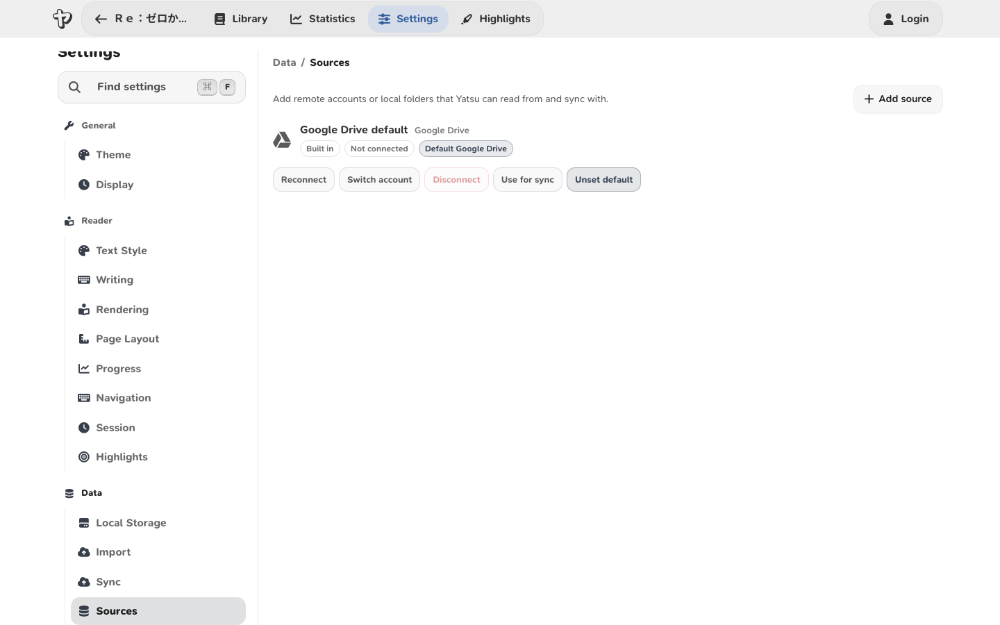

# WebDAV Storage

Yatsu can use a WebDAV server as an external library and sync source. This is useful if you keep your books on a NAS, a self-hosted file server, or a service that exposes a WebDAV collection.

WebDAV storage is separate from Yatsu Accounts and Settings Sync. A Yatsu account can sync some app settings, while WebDAV stores books and book-related data in your own server.

## Requirements

You need:

- a WebDAV collection URL that the browser can reach
- a username and password for that WebDAV account
- permission to create folders, upload files, rename files and folders, and delete files in that collection

If you use the hosted Yatsu app over HTTPS, the WebDAV URL should also use HTTPS. Browsers usually block app requests from an HTTPS page to a plain HTTP server.

Your WebDAV server or reverse proxy must allow browser cross-origin requests from Yatsu. If the server does not send the required CORS headers for `PROPFIND`, `MKCOL`, `GET`, `PUT`, `MOVE`, and `DELETE`, the browser will block the connection before Yatsu can read the response.

For rename support, CORS must also allow the `Destination` and `Overwrite` request headers used by WebDAV `MOVE` requests.

If you are setting up WebDAV on Windows, follow the [Windows WebDAV setup guide](webdav-windows.md). It shows a known-good rclone and Caddy configuration with HTTPS and the CORS headers Yatsu needs.

## Add a WebDAV source

1. Open **Settings** -> **Data** -> **Sources**.
2. Choose **Add source**.
3. Give the source a name, such as `NAS Library`.
4. Choose **WebDAV (Beta)** from the provider dropdown.
5. Enter the WebDAV URL, username, and password.
6. Choose whether this source should be the sync target or default WebDAV source.
7. Save the source.
8. Return to the Library and choose **WebDAV (Beta)** from the storage picker.



The WebDAV URL should point to the parent collection where Yatsu is allowed to create its data folder. For example:

```text
https://nas.example.com/remote.php/dav/files/reader/
```

Yatsu creates and uses a `yatsu-reader-data` folder inside that collection.

## What WebDAV Sync Can Move

WebDAV storage sync can move reading data between this browser and your WebDAV server, including:

- books and cover files
- current reading progress
- saved bookmarks
- highlights
- reading statistics and streak data
- reading goals
- audiobook and subtitle data

Yatsu still uses the browser database as the live app database while you read. WebDAV is the external storage source that Yatsu imports from and exports to when sync runs.

## Renaming Books

When you rename a book while browsing a WebDAV library, Yatsu renames that book's folder inside `yatsu-reader-data`.

Yatsu treats the WebDAV folder name as the current book title. If older embedded book data still contains the previous title, Yatsu keeps using the folder title when it opens or syncs the book.

Your WebDAV server must support `MOVE` on folders for this to work. Reverse proxies and CORS rules must pass the `Destination` and `Overwrite` headers through to the WebDAV server.

## Server Compatibility Notes

WebDAV servers vary. If a source fails to connect, check these common issues:

- The URL must be reachable from the device and browser where Yatsu is running.
- Hosted Yatsu pages should use an HTTPS WebDAV endpoint.
- The WebDAV server must support the methods Yatsu uses: `PROPFIND`, `MKCOL`, `GET`, `PUT`, `MOVE`, and `DELETE`.
- CORS must allow Yatsu's origin, the `Authorization`, `Content-Type`, `Depth`, `Destination`, and `Overwrite` request headers, and the WebDAV methods above.
- Reverse proxies must pass WebDAV methods and headers through to the server.
- The account needs write permission in the selected collection.

Some NAS products expose WebDAV under a user-specific path. Others expose a shared collection. Use the exact URL your server documents for WebDAV clients, not a normal browser file-sharing page.

## Storage Layout

WebDAV storage is a Yatsu-specific source. It uses the `yatsu-reader-data` root folder and Yatsu's existing book data file names inside each title folder. Renaming a book in Yatsu renames that title folder.
